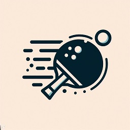

<!-- PROJECT LOGO -->
 

  

<h3 align="center">Uno Pong</h3>
  

    A simple pong game running on an Arduino Uno and an SSD1306 OLED display.
     
     
    <a href="https://github.com/distroquerim/uno_pong">View Demo</a>
  

<!-- ABOUT THE PROJECT -->
## About The Project

Implementation of a basic pong game played against a computer controlled player on a cheap OLED display with a basic UI. Player controls use generic push buttons.
Built for a beginner Arduino project and showcase.

### Built With

* [PlatformIO](https://platformio.org/)
* [Visual Studio Code](https://code.visualstudio.com/)

### Hardware

* [Funduino Uno](https://funduinoshop.com/en/electronic-modules/other/microcontroller/funduino-uno-r3-microcontroller-arduino-compatible)
* SSD1306 I2C OLED Display
* Basic push buttons

## Demo

Use this space to show useful examples of how a project can be used. Additional screenshots, code examples and demos work well in this space. You may also link to more resources.

## License

Distributed under the MIT License. See `LICENSE.txt` for more information.

## Contact

distroquerim - distroquerim@gmail.com
Project Link: [https://github.com/distroquerim/uno_pong](https://github.com/distroquerim/uno_pong)